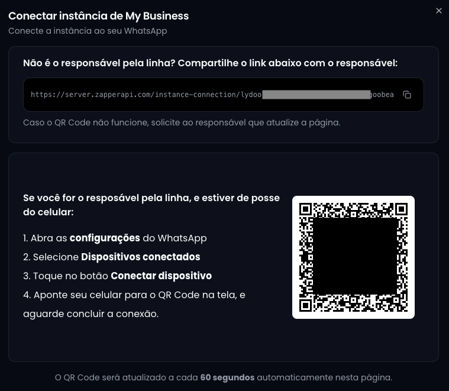

Uma vez criada sua instância, o próximo passo é **Conectar seu WhatsApp** na 
instância.

  Para isso, clique no botão <strong>Conectar</strong>
  

    <Icon icon="play" size={14} color="#ffffff" />
  

  que fica localizado junto à sua instância.

A seguinte caixa de diálogo de conexão se abrirá:

Você pode se conectar diretamente na tela exibida, ou se preferir, compartilhar
o link de conexão para outra pessoa utilizar.

<Card title="DICA">
Caso a conexão falhe após a leitura do QR Code, recomendamos tentar novamente
após o QR Code atualizar na tela, o que demora cerca de 60 segundos.
</Card>