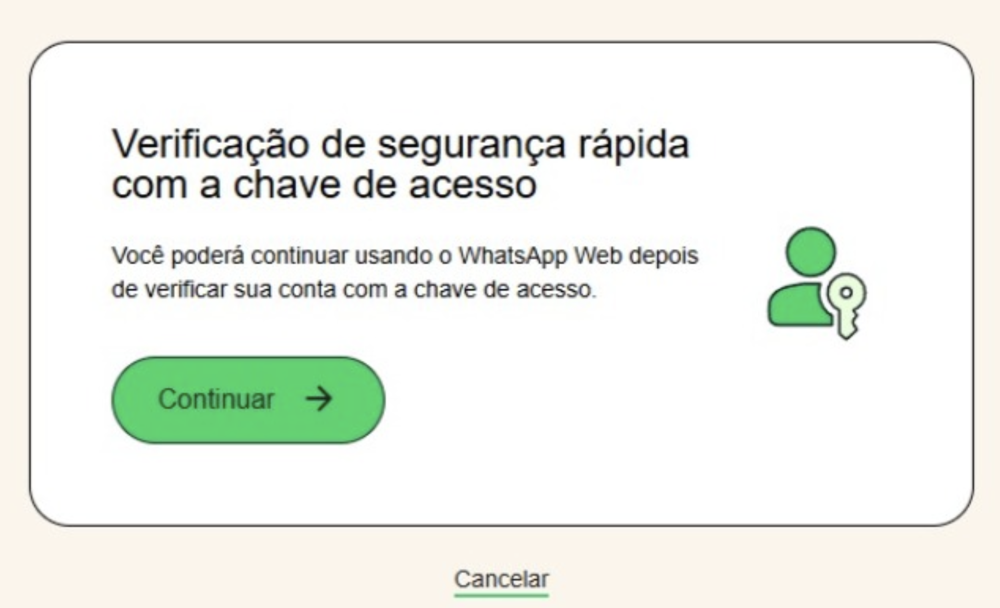
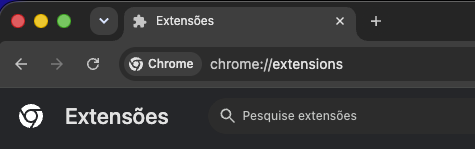
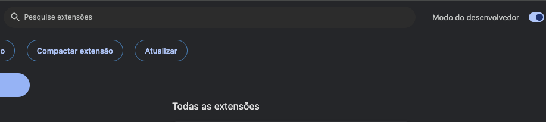
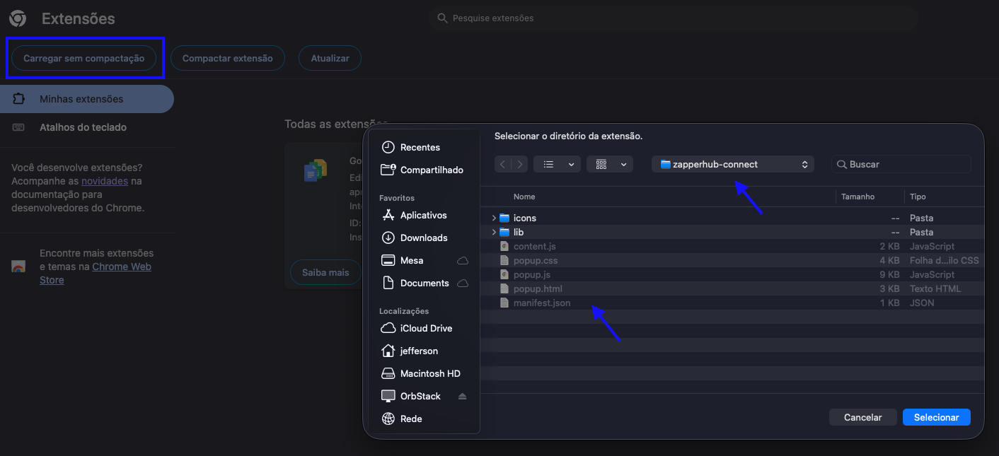
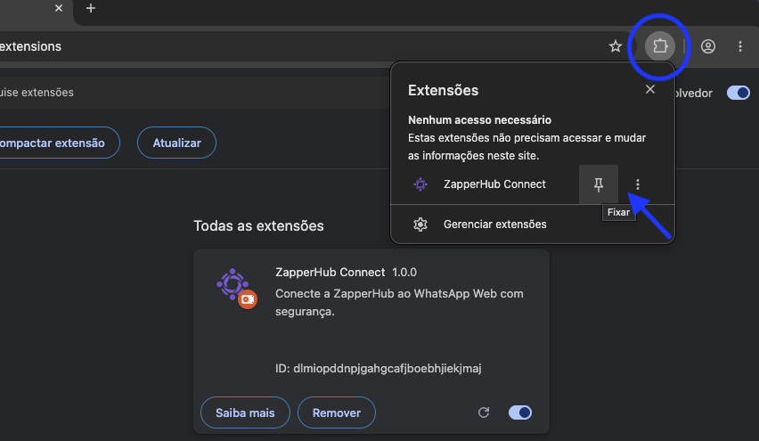
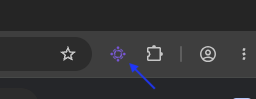
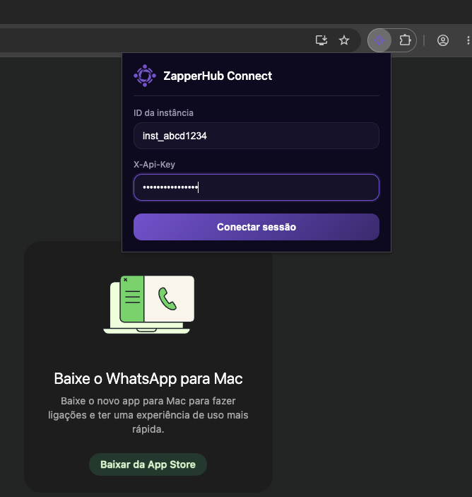

## O que é a ZapperHub Connect 

A ZapperHub agora oferece uma nova forma de se conectar na instância: A extensão
ZapperHub Connect.

Esta opção é a recomendada para dispositivos que exigem verificação de segurança
adicional (chave de acesso) ao tentar se conectar no WhatsApp Web, 
conforme imagem abaixo:

Neste caso, se notar que o fluxo de conexão por QR Code ou código de pareamento
não está funcionando, é provável que o dispositivo está exigindo a chave de acesso,
de modo que terá que utilizar esta extensão para se conectar na ZapperHub.

<Card title="IMPORTANTE">
Nem todos os dispositivos exigem essa verificação com chave de acesso, mas a 
conexão via ZapperHub Connect funciona para qualquer dispositivo.
</Card>

## Como utilizar

<Card title="AVISO">
Nossa extensão ainda encontra-se em processo de liberação na loja de extensões do
Google Chrome. Enquanto isso, estamos disponibilizando a instalação no modo de 
desenvolvimento.
</Card>

### Download da extensão

1. Faça o download da extensão por este link <a href="https://storage.zapperapi.com/assets/extensions/zapperhub-connect.zip">aqui</a>

2. Após o download, descompacte o arquivo em seu computador (por exemplo "Downloads/zapperhub-connect").

### Instalando no Google Chrome

1. Abra o Google Chrome, e na barra de endereço, digite <a href="chrome://extensions">chrome://extensions</a>

2. Ative o **Modo do desenvolvedor** localizado no canto superior direito da página de extensões

3. Clique no botão **Carregar sem compactação** e selecione a pasta que acabou
de descompactar. Certifique-se que dentro da pasta estejam os arquivos da extensão,
como por exemplo o **manifest.json**

4. Agora, clique no botão "Extensões" localizado logo após a barra de endereço, e clique
no pin ao lado da extensão ZapperHub Connect para fixar a extensão na barra superior.

Pronto, a extensão da ZapperHub Connect está instalada e pronta para uso!

## Conectando com o WhatsApp

1. Abra o WhatsApp web em <a href="https://web.whatsapp.com">https://web.whatsapp.com</a>

2. Leia o QR Code e siga as instruções para se conectar normalmente. Caso seja orientado
a utilziar chave de acesso, será necessário utilizar um aplicativo compatível para 
gerenciamento de chaves de acesso, como o Google Authenticator, 1Password, ou dispositivo
físico como Face ID ou Touch ID

3. Após conectado, clique no botão da extensão ZapperHub Connect para abrir o popup de conexão

4. Digite o id da instância e a X-Api-Key, e após, clique em **Conectar sessão**

5. Aguarde alguns segundos para finalizar o processo de exportação da sessão para
a ZapperHub. Após a exportação, e para evitar conflitos de dispositivos, a sessão
do WhatsApp Web será automaticamente desconectada.

<Card title="IMPORTANTE">
Caso a exportação falhe, recarregue a página do WhatsApp Web e repita os procedimentos.
Certifique-se que a instância que deseja se conectar esteja desconectada para evitar
falhas no processo.
</Card>
