Há duas maneiras de se connectar com a ZapperAPI na plataforma Make:

  
  <strong>App da ZapperAPI</strong>: É a forma recomendada, e atenderá a maioria dos casos de uso. A integração é mais simplificada e menos propensa a erros.

  
  <strong>Requisição HTTP (nativo do Make)</strong>: É a forma alternativa quando o App da ZapperAPI não contemplar a solução. Deve ser usado com mais cuidado pois é mais sucetível a erros no preenchimento dos campos.

## App da ZapperAPI

1. Acesse este link para instalar o App da ZapperAPI: https://us2.make.com/app/invite/23387626ccaf253247e64f57566ffa15

2. Clique no botão Install: 
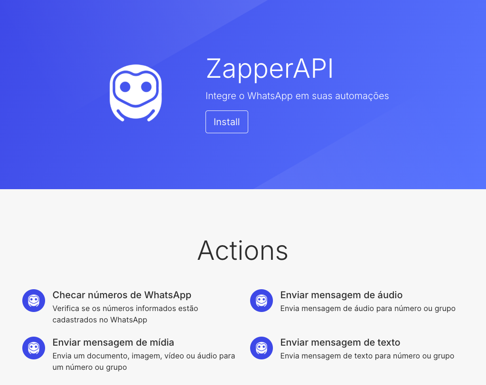

3. Na tela seguinte, <strong>selecione a Organização</strong> onde deseja instalar o App da ZapperAPI e em seguida clique em <strong>Install</strong>:
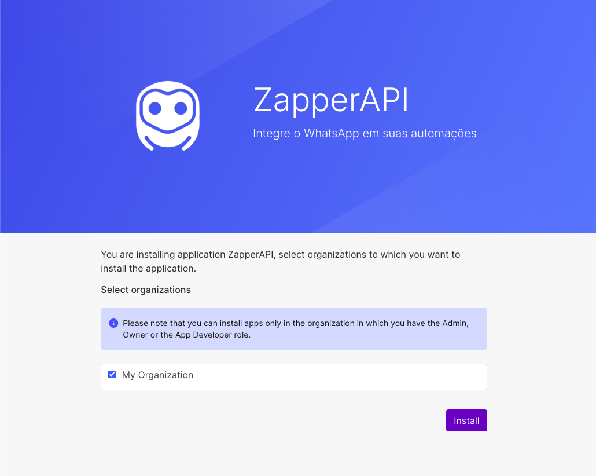
<strong>Importante:</strong>
É necessário ter permissão de `Admin`, `Owner` ou `App Developer` da organização
para instalar novos apps. Caso não a tenha, envie <a href="#app-da-zapperapi">esta página</a> ao seu gestor para executar os passos de 1 a 4.

4. Em seguida, clique em <strong>Finish Wizard</strong> para concluir a instalação:
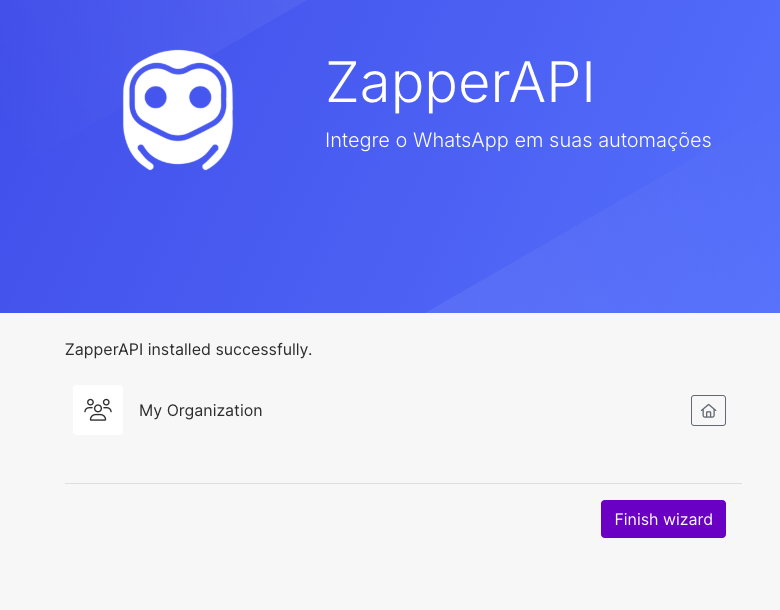

5. Em seu cenário, <strong>adicione um novo módulo</strong>, e pesquise por <strong>ZapperAPI</strong>:
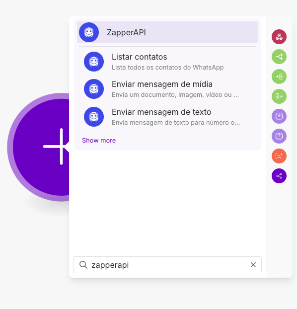

6. Selecione o módulo que deseja utilizar, e na tela seguinte, caso ainda não tenha
feito, crie uma nova conexão clicando em <strong>Create a connection</strong>:
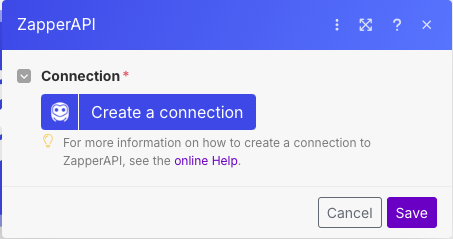

7. Preencha os dados de sua conexão com a ZapperAPI (o `Id da instância` e a `API Key` encontram-se no <a href="https://app.zapperapi.com/dash" target="_blank">dashboard</a>):
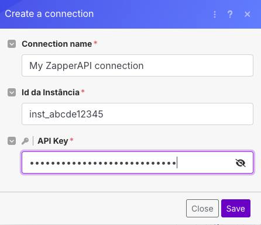

8. Agora basta preencher os campos para executar o módulo, como no exemplo abaixo
(módulo de enviar mensagem de texto):
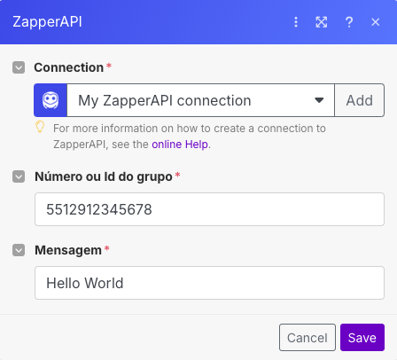

Pronto! Você configurou com sucesso sua integração da ZapperAPI em suas automações no Make.

## HTTP (nativo do Make)

1. Em seu cenário, adicione o módulo <strong>HTTP -> Make an API Key Auth request</strong>:
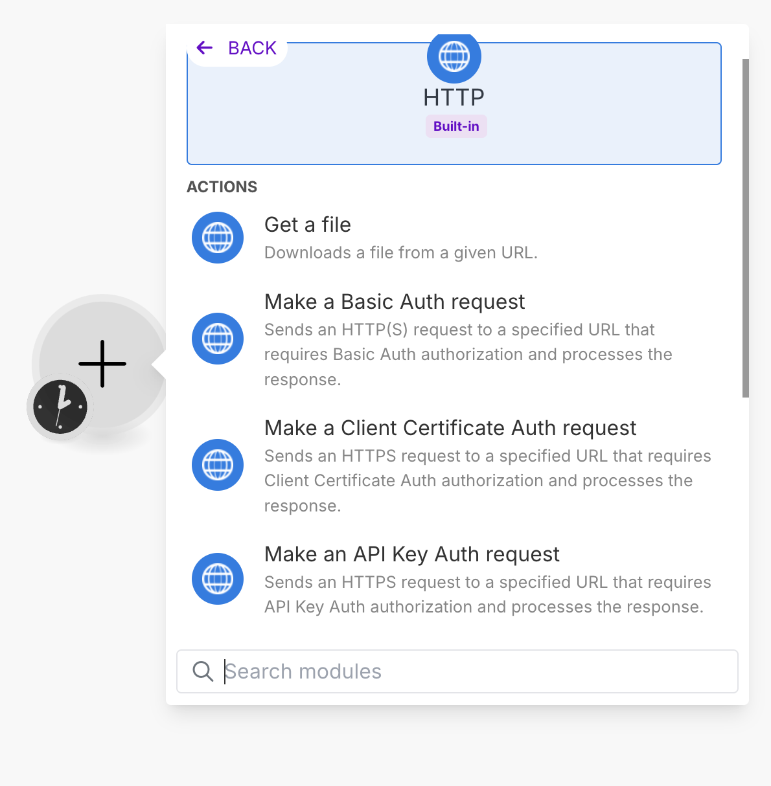

2. Em Credentials, selecione as credenciais da ZapperAPI, ou se não tiver uma, clique em <strong>Create a keychain</strong>:
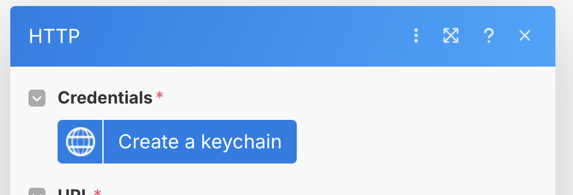

3. Em <strong>Add new keychain</strong>, preencha o campo <strong>Key</strong> com a chave (API Key) de sua instância, mantendo
os demais campos no padrão:
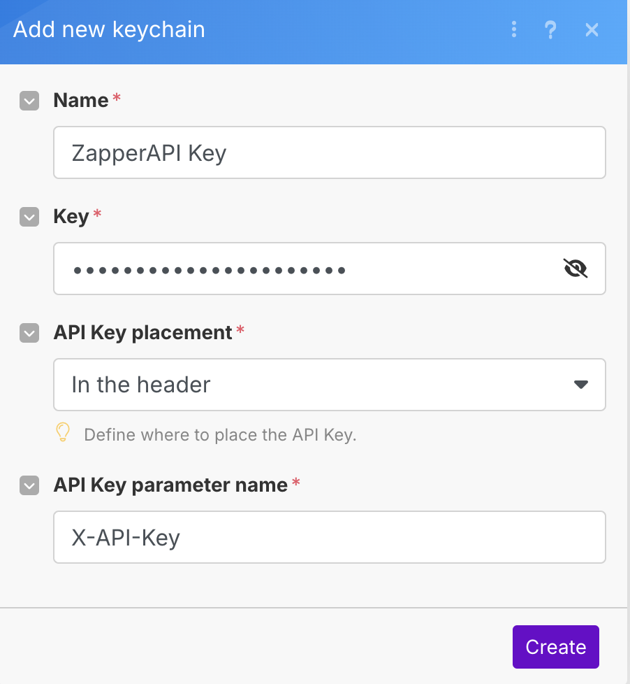

4. De volta a tela de preenchimento do módulo HTTP, complete o campo URL com a URL completa da requisição que for fazer
(ex: para envio de mensagens de texto a URL é `https://api.zapperapi.com/{instanceId}/messages/text), o método (ex: POST),
e os dados da requisição no formato JSON, conforme figura abaixo:
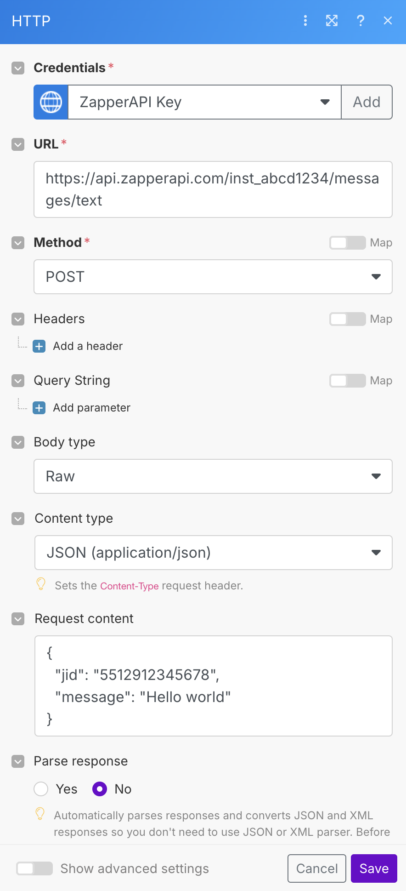

Agora só clicar em <strong>Save</strong> e sua integração ao ZapperAPI está pronta!
