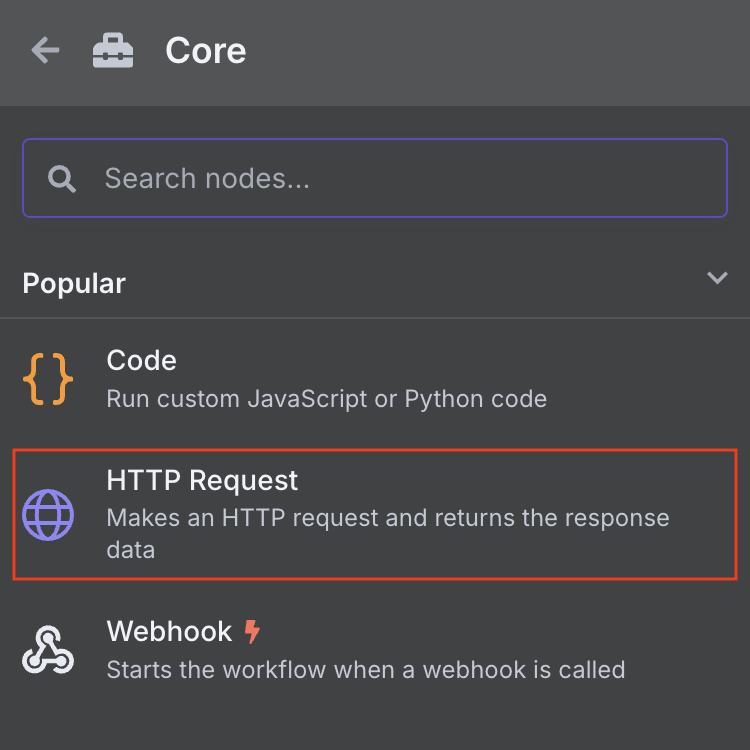
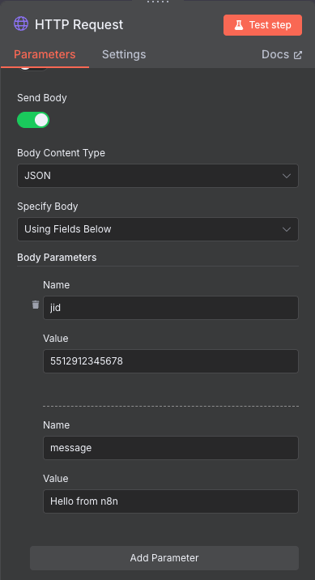

N8N é uma ferramenta poderosa de automação de fluxos e tarefas. A integração da 
ZapperAPI no N8N é realizada via Nó de **HTTP Request**, conforme indicado nos
passos a seguir:

1. Clique no botão para adicionar um novo nó, e selecione no menu lateral a
opção **Core** e em seguida, **HTTP Request**;

  

2. No campo **Method**, selecione o método que for utilizar. Por exemplo, para enviar
mensagem, o método é o `POST`;

3. Em **URL**, digite a URL completa de acesso ao recurso (ex: https://api.zapperapi.com/inst_abcdefg123456/messages/text para enviar uma mensagem de texto);

4. Em **Authentication**, selecione a opção **Generic Credential Type**, e **Header Auth** para o tipo de autenticação genérica;

5. No campo **Header Auth**, clique em **Create new credential**, e na janela 
que se abre, nomeie o nome da credencial para `ZapperAPI Auth` (basta clicar sobre o 
título da janela para editar), preencher o campo **Name** com o valor `X-Api-Key`
e o campo **Value** com o **valor da sua chave de API** (ex: `sk_abcdEfgH_123XPtO`).
Em seguida, clique em **Save** e feche a janela;

6. Selecione o checkbox **Send Body** e em **Body Parameters**, preencha os campos
*Name* e *Value* com os valores da requisição. Por exemplo, para enviar mensagem, os
campos seriam preenchidos da seguinte maneira:

  

7. Feche a janela de criação do Nó e em seguide clique em **Test Workflow** para
realizar o teste de envio da mensagem.
